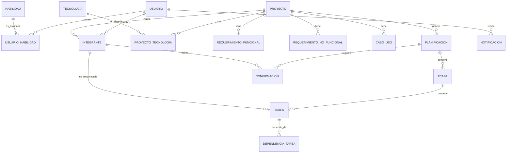

# 02 — Relaciones entre entidades

## 16. Relaciones

Relaciones principales (todas en el esquema `usuario`):

| Relación | Cardinalidad | Descripción |
|---|---|---|
| Usuario ↔ Habilidad | N:M (vía `UsuarioHabilidad`) | Un usuario registra varias habilidades; una habilidad puede estar en varios perfiles. |
| Usuario ↔ Proyecto | N:M (vía `Integrante`) | Un usuario participa en varios proyectos; un proyecto reúne varios integrantes. `Integrante` guarda `rol` y `estado` de invitación. |
| Proyecto ↔ Tecnologia | N:M (vía `ProyectoTecnologia`) | Un proyecto usa varias tecnologías; una tecnología aparece en varios proyectos. |
| Proyecto → RequerimientoFuncional | 1:N | Un proyecto tiene varios RF. |
| Proyecto → RequerimientoNoFuncional | 1:N | Un proyecto tiene varios RNF. |
| Proyecto → CasoUso | 1:N | Un proyecto tiene varios casos de uso. |
| Proyecto → Planificacion | 1:N | Un proyecto tiene (al menos) una planificación; en el MVP una sola generada con IA. |
| Planificacion → Etapa | 1:N | Una planificación tiene varias etapas. |
| Etapa → Tarea | 1:N | Una etapa tiene varias tareas. |
| Integrante → Tarea (responsable) | 1:N | Un integrante puede ser responsable de varias tareas; cada tarea tiene como máximo un responsable. |
| Tarea ↔ Tarea (dependencia) | N:M (vía `DependenciaTarea`) | Dependencia finish-to-start, sin ciclos. |
| Planificacion → Confirmacion | 1:N | Una planificación tiene una confirmación por integrante. |
| Integrante → Confirmacion | 1:N | Un integrante confirma su participación en la propuesta. |
| Usuario → Notificacion | 1:N | Un usuario recibe varias notificaciones. |

## Diagrama entidad-relación

## Notas

- `INTEGRANTE` es la tabla de pertenencia (join) que además guarda `rol` y `estado` de invitación.
- `DEPENDENCIA_TAREA` es la tabla join de la auto-relación Tarea ↔ Tarea.
- El estado `BLOQUEADA` de una tarea se **calcula** (no se persiste) a partir de `DependenciaTarea` (RN-06).
- Las fechas (`fechaInicio` / `fechaFin`) se calculan en el backend (RN-20); no las propone la IA.
- El **esquema `admin`** (Django) aún no tiene entidades definidas (funciones de Administración por definir).
