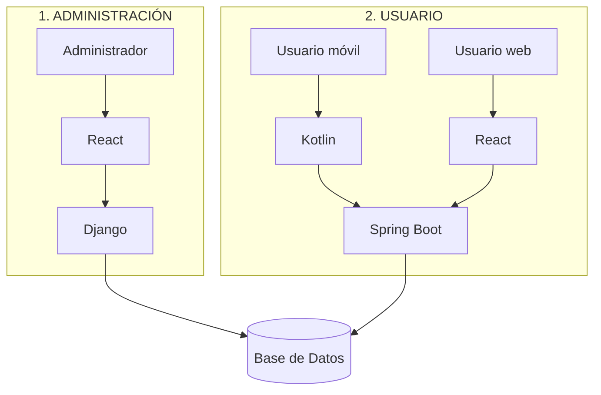
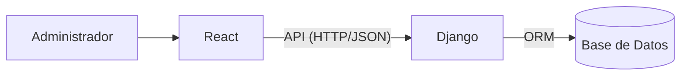
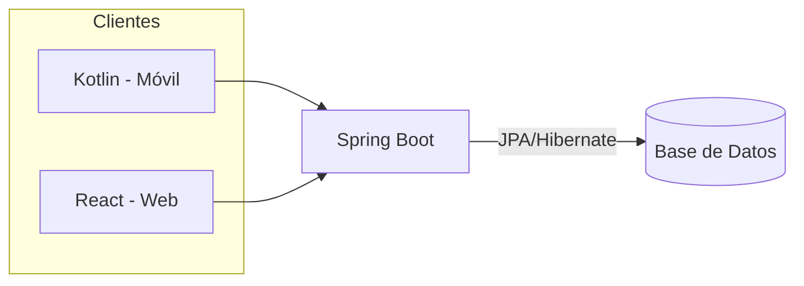
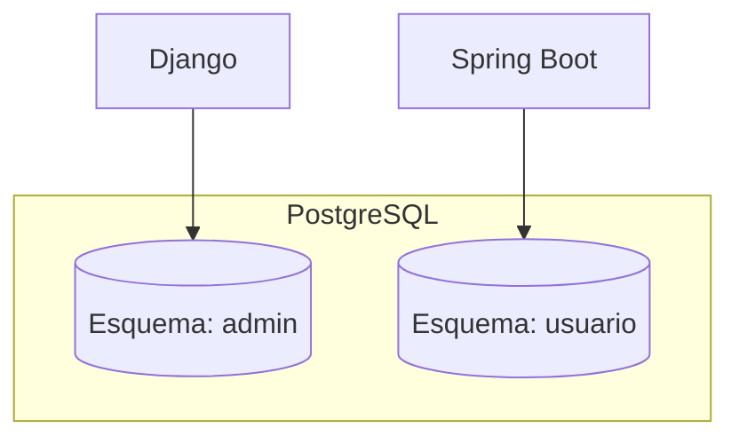
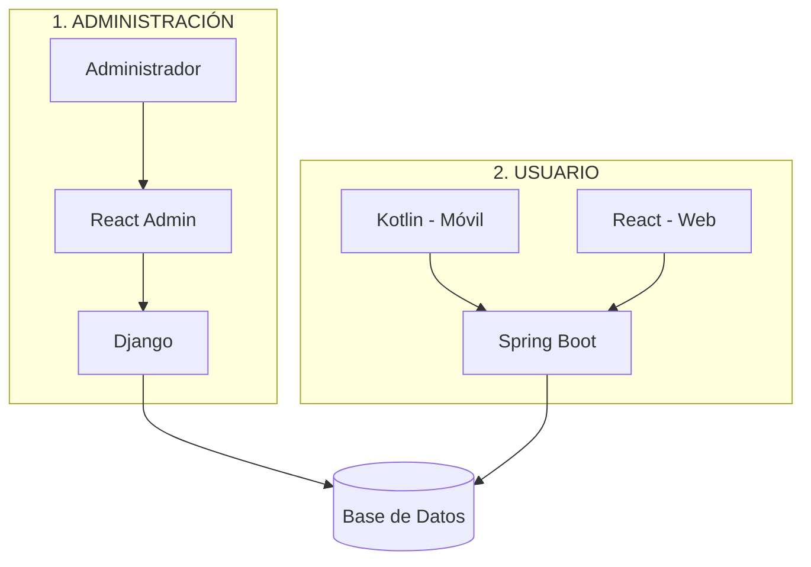

# Arquitectura del Sistema

> **Estado del documento: arquitectura de referencia (objetivo).**
> A la fecha, el repositorio **no contiene código**: únicamente existe la carpeta `docs/`.
> Este documento describe la arquitectura objetivo del sistema **Colab** y señala, capa por capa,
> qué está implementado, qué estaba documentado previamente y qué es nuevo o pendiente.

---

## 1. Descripción general

**Colab** es una aplicación de apoyo a la planificación y organización de proyectos académicos de
software, que utiliza inteligencia artificial para generar una propuesta de planificación
personalizada según el proyecto y las habilidades del equipo.

La arquitectura del sistema se divide en **dos grandes áreas** con responsabilidades separadas:

1. **Administración** — plataforma web destinada a las operaciones administrativas.
2. **Usuario** — los clientes que usan los usuarios finales (estudiantes).

Ambas áreas se apoyan en **backends distintos** (Django para Administración, Spring Boot para
Usuario) que, a su vez, acceden a una **misma base de datos compartida**. Esto garantiza una única
fuente de verdad para todo el sistema y permite que cada área evolucione de forma independiente.

El propósito de dividir el sistema en **Administración** y **Usuario** es separar claramente:

- Las **tareas de gestión/soporte** (mantenimiento de usuarios, configuración, administración de
  la plataforma), que no forman parte del uso cotidiano por parte del estudiante.
- Las **funciones de uso final** (crear proyectos, generar planificaciones con IA, confirmar tareas,
  cambiar estados), que concentran el valor funcional de Colab.

A continuación se muestra una vista global de la arquitectura:

> **Nota de estado:** esta es la arquitectura objetivo. En la práctica **aún no hay código** y parte
> de estos componentes **no están descritos en la documentación previa del proyecto** (ver
> [sección 6](#6-estado-de-implementacin-y-diferencias-con-la-documentacin-existente)).

---

## 2. Arquitectura de Administración

> **Estado de implementación: ❌ No implementado (sin código todavía; forma parte del entregable MVP).**

La plataforma de **Administración** es una aplicación web compuesta por un frontend en **React** y
un backend en **Django**.

### Capas y responsabilidades

| Capa | Tecnología | Responsabilidad principal |
|------|-----------|---------------------------|
| Frontend web | **React** | Interfaz para que los administradores realicen las operaciones administrativas. Consume la API de Django. |
| Backend | **Django** | Lógica de negocio administrativa y acceso a la base de datos. Expone una API REST consumida por React. |
| Base de datos | Compartida (ver [sección 4](#4-base-de-datos-compartida)) | Persistencia de los datos del sistema. |

### Comunicación React → Django

- React se comunica con Django mediante una **API** (HTTP/JSON).
- Django es responsable de la **lógica de negocio** del área de administración y del **acceso a la
  base de datos**.
- React **no** accede directamente a la base de datos; toda operación pasa por Django.

### Comunicación Django → Base de Datos

- Django accede a la base de datos compartida mediante su capa de datos (ORM de Django).
- Aplica validaciones y reglas de negocio antes de persistir o leer información.

### Diagrama

---

## 3. Arquitectura de Usuario

> **Estado de implementación: ❌ No implementado.**

El área de **Usuario** tiene **dos clientes** que comparten un **único backend** en Spring Boot:

- **A. Aplicación móvil** (Kotlin).
- **B. Aplicación web** (React).

Ambos clientes consumen el **mismo backend** de Spring Boot.

### Capas y responsabilidades

| Capa | Tecnología | Responsabilidad principal |
|------|-----------|---------------------------|
| Cliente móvil | **Kotlin** (Android) | Interfaz nativa para los estudiantes. Consume la API de Spring Boot. |
| Cliente web | **React** | Interfaz web para los estudiantes. Consume la misma API de Spring Boot. |
| Backend | **Spring Boot** (Java) | **Único backend** del área de usuario: lógica de negocio, autenticación, generación con IA y acceso a datos. |
| Base de datos | Compartida (ver [sección 4](#4-base-de-datos-compartida)) | Persistencia de los datos del sistema. |

### Responsabilidades de Spring Boot (backend de Usuario)

De acuerdo con la documentación de análisis del proyecto, al backend de Spring Boot le corresponderá,
entre otras cosas:

- Autenticación por correo y contraseña, con protección de la API mediante tokens (JWT).
- Control de acceso según el rol (Creador / Integrante) y el proyecto al que pertenezca el usuario.
- Lógica del flujo de planificación: validación de información mínima, llamada a la IA ("La BestIA"),
  validación de la salida, cálculo de fechas y guardado de la propuesta en estado `PROPUESTA`.
- Gestión de estados y transiciones de las tareas (incluida la derivación del estado `BLOQUEADA`).
- Centralización de la clave de la IA (token), que **nunca** se expone a los clientes.

### Comunicación de los clientes con Spring Boot

- Tanto la aplicación móvil (Kotlin) como la aplicación web (React) se comunican con Spring Boot a
  través de la **misma API REST** (HTTP/JSON).
- Los clientes **no** acceden directamente a la base de datos; toda operación pasa por Spring Boot.

### Diagrama

---

## 4. Base de datos compartida

> **Estado de implementación: ❌ No implementado (sin esquema todavía).**

Existe una **única instancia de PostgreSQL compartida** por los dos backends, organizada en **dos esquemas separados**:

- **Esquema `usuario`** → gestionado por **Spring Boot** (área de Usuario) mediante **JPA/Hibernate + Flyway**.
- **Esquema `admin`** → gestionado por **Django** (área de Administración) mediante **las migraciones propias de Django**.

Cada backend es **dueño de su propio esquema** y aplica allí sus migraciones; no se mezclan los
sistemas de migración (Flyway para Spring Boot; migraciones de Django para Django). Si un área
necesita datos gestionados por la otra, debe hacerlo a través de la **API del backend dueño**, sin
acceder directamente a su esquema. Esto mantiene una única fuente de verdad física con una
separación lógica clara por área.

---

## 5. Diagrama general de la arquitectura

---

## 6. Estado de implementación y diferencias con la documentación existente

> La documentación del proyecto se **sincronizó** con esta arquitectura (se incorporaron la
> aplicación web de usuario y la plataforma de administración). Las diferencias listadas a
> continuación describen el contraste con el **estado previo** de los documentos.

### Estado real del repositorio

- El repositorio contiene **únicamente documentación** (carpeta `docs/`).
- **No existe código** de ningún componente de la arquitectura (no hay React, no hay Django, no hay
  Kotlin, no hay Spring Boot, no hay esquema de base de datos).
- Por lo tanto, **toda la arquitectura descrita en este documento está pendiente de implementación**.

### Estado por componente

| Componente | En la arquitectura de referencia | En la documentación previa | Estado de implementación |
|------------|----------------------------------|----------------------------|--------------------------|
| Administración — React | ✅ | ❌ No mencionado | ❌ No implementado |
| Administración — Django | ✅ | ❌ No mencionado | ❌ No implementado |
| Usuario — móvil (Kotlin) | ✅ | ✅ Mencionado (Android/Kotlin/Jetpack Compose) | ❌ No implementado |
| Usuario — web (React) | ✅ | ❌ No mencionado | ❌ No implementado |
| Backend Usuario — Spring Boot | ✅ | ✅ Mencionado (Java/Spring Boot, API REST) | ❌ No implementado |
| Base de datos | Compartida (Django + Spring Boot) | Solo PostgreSQL + JPA/Hibernate + Flyway | ❌ No implementado |

### Diferencias detectadas (arquitectura de referencia vs. documentación previa)

1. **Backend de Administración (Django): nuevo.**
   La documentación previa del proyecto **no contempla** una plataforma de administración ni el uso
   de Django. Todo el sistema se definía con un único backend (Spring Boot).

2. **Frontend web de Usuario (React): nuevo.**
   La documentación previa declara la aplicación móvil Android como **"única interfaz del sistema"**.
   La arquitectura de referencia añade una **aplicación web** (React) para los usuarios, que usa el
   mismo backend de Spring Boot.

3. **Frontend web de Administración (React): nuevo.**
   Al no existir un área de administración en la documentación previa, tampoco existía su frontend.

4. **Base de datos compartida entre dos backends: nuevo.**
   La documentación previa solo menciona una base de datos (PostgreSQL) accedida por Spring Boot.
   La arquitectura de referencia establece que **Django y Spring Boot comparten la misma instancia de
   PostgreSQL**, organizada en **dos esquemas separados** (`usuario` con Flyway/JPA y `admin` con las
   migraciones de Django); ver [sección 4](#4-base-de-datos-compartida).

5. **Relación con la IA ("La BestIA").**
   La documentación previa define que la llamada a la IA se realiza **siempre desde Spring Boot**.
   No se ha definido (ni en esta arquitectura de referencia) responsabilidad alguna de Django respecto
   a la IA. Se asume, por tanto, que la IA permanece ligada exclusivamente al área de Usuario.

> **Conclusión:** la arquitectura aquí documentada **extiende** la arquitectura original del proyecto.
> Los componentes que ya estaban definidos (móvil Kotlin y backend Spring Boot) coinciden en su rol;
> los componentes de **Administración (React + Django)** y el **cliente web de Usuario (React)** se
> incorporaron como nuevos. La documentación (contexto, objetivos, alcance y análisis) se actualizó
> para reflejarlos. La plataforma de administración **forma parte del entregable MVP**; su alcance
> funcional detallado se define en el diseño y la gestión.

